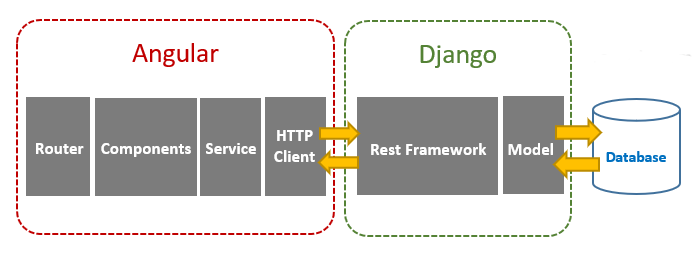

# GSN Global Sensor Networks: The Client Web UI

This is a web interface for exploring the data processed by GSN. 
It is based on the python Django framework (backend) and Angular CLI (frontend). 
It interacts with the gsn-services module where it uses authentication and the client API.

For development purposes typically `localhost` is used. For testing in a real server environment a canoncial host name may be used. 
For now configuration of this is all over the code/config.

## GSN-Webui-Backend 
### Quick start

Before starting you need python3 and some required packages. It is recommended to work inside a [virtualenv](http://docs.python-guide.org/en/latest/dev/virtualenvs/).

    cd gsn-webui-backend 
    [ -d env3 ] || virtualenv -p python3 env3
    source env3/bin/activate
    pip install -r requirements.txt
    cp app/settingsLocal.py.dist app/settingsLocal.py
    python manage.py migrate
    python manage.py runserver walker.uibk.ac.at:8000

### Configuration

You can setup the backend database used by Django for storing users preferences by editing the app/settingsLocal.py file. 
It also contains the informations to connect to the gsn-services API.

For production environments, don't use the integrated web server and refer to the official [Django documentation](https://docs.djangoproject.com/en/1.8/howto/deployment/) or use a packaged release of gsn-webui.

    python manage.py createsuperuser
    admin perma.PW

    http://walker.uibk.ac.at:8000/admin

## GSN-Webui-Frontend
This project was generated with [Angular CLI](https://github.com/angular/angular-cli) version 16.1.0.

Install the CLI using the npm package manager as superuser: `npm install -g @angular/cli` or locally for development purposes: `npm install --legacy-peer-deps`

## Building
Run `ng build` to build the project. The build artifacts will be stored in the `dist/` directory.

### Development Server
Run `ng serve` for a dev server. Navigate to `http://localhost:4200/`. The application will automatically reload if you change any of the source files.

    ng serve --host walker.uibk.ac.at --verbose

## Code Scaffolding
Run `ng generate component component-name` to generate a new component. You can also use `ng generate directive|pipe|service|class|guard|interface|enum|module`.

## Running unit tests
Run `ng test` to execute the unit tests via [Karma](https://karma-runner.github.io).

## Running end-to-end tests
Run `ng e2e` to execute the end-to-end tests via a platform of your choice. To use this command, you need to first add a package that implements end-to-end testing capabilities.

## Further help
To get more help on the Angular CLI use `ng help` or go check out the [Angular CLI Overview and Command Reference](https://angular.io/cli) page.
